# Jetty Chart 시연 시나리오

---

## 1. 제티차트를 설치합니다 `npm i jetty-chart`

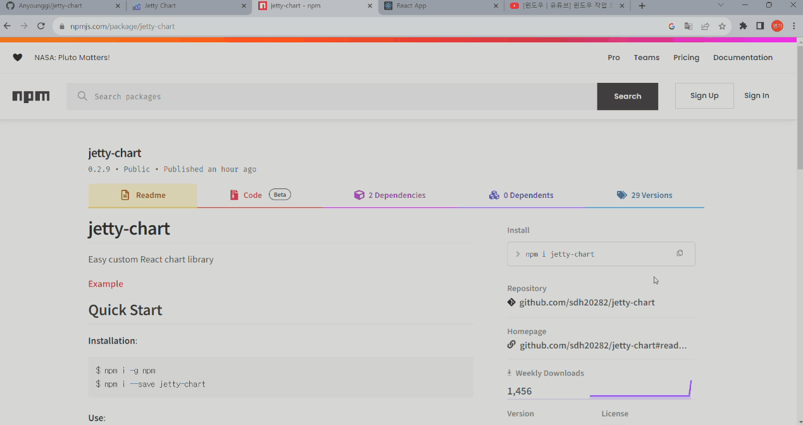

 

## 2. `http://jettychart.com`에 접속합니다.
   
   jetty chart는 로그인 없이 바로 사용 가능합니다. `Get Start`를 누르면 jetty chart에서 지원하는 차트 리스트가 나타납니다. 원하는 차트를 선택합니다. 

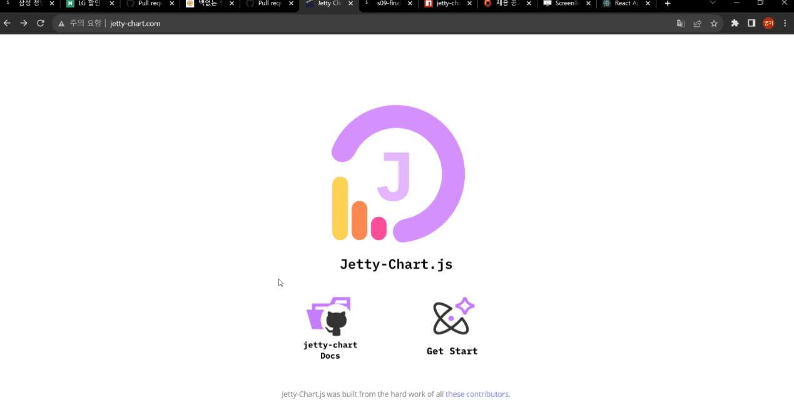

 

## 3. 축 제목, 레이블, 축의 최대최소값, 색상, 축 출력 여부, 애니메이션 등 다양한 세부항목을 선택하여 설정할 수 있습니다.

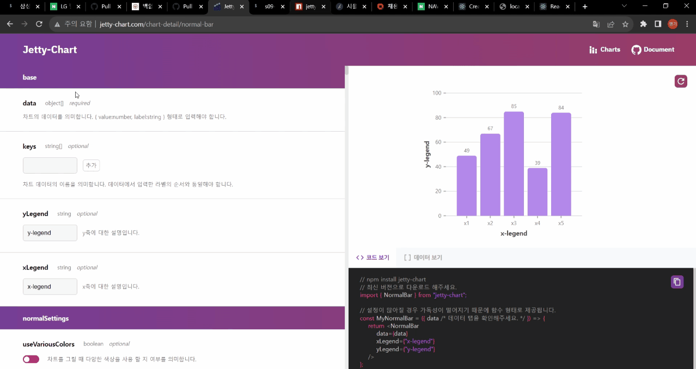

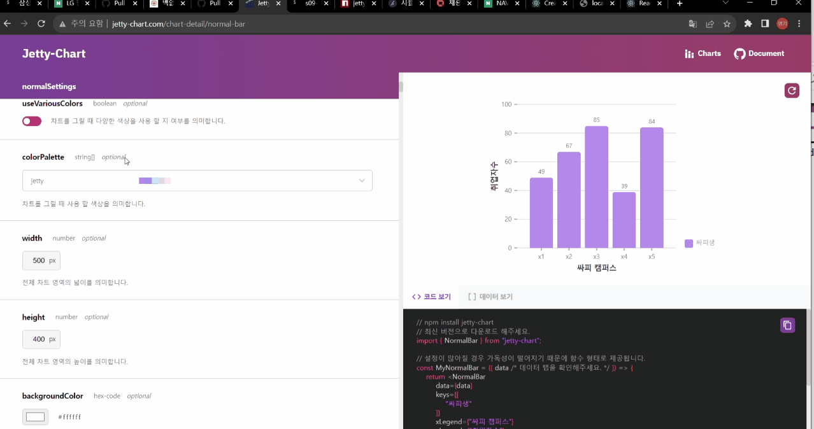

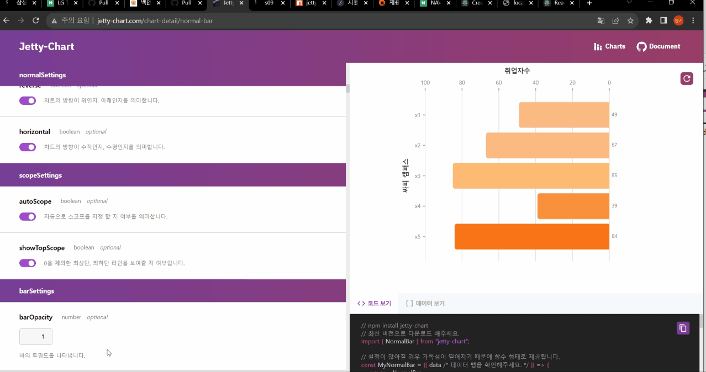

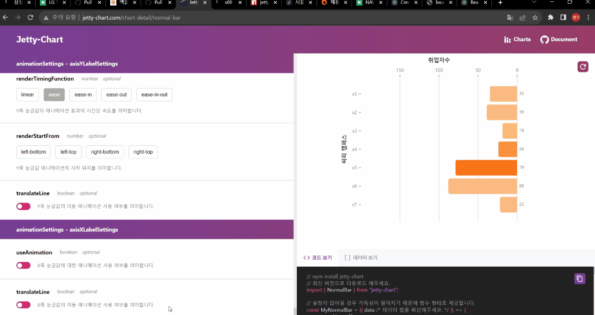

 

## 4. 각 차트 별로 다양한 커스텀 기능을 사용할 수 있습니다. 실시간으로 변화하는 차트를 보고 원하는 대로 설정합니다.

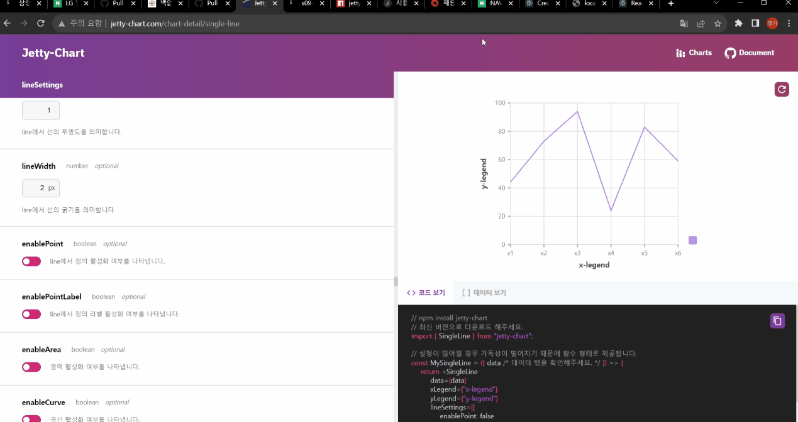

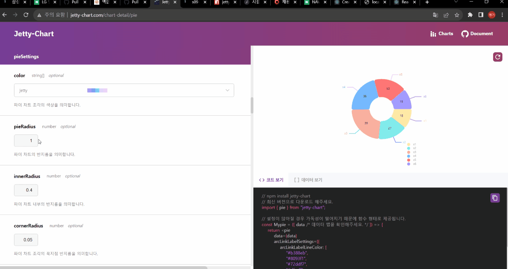

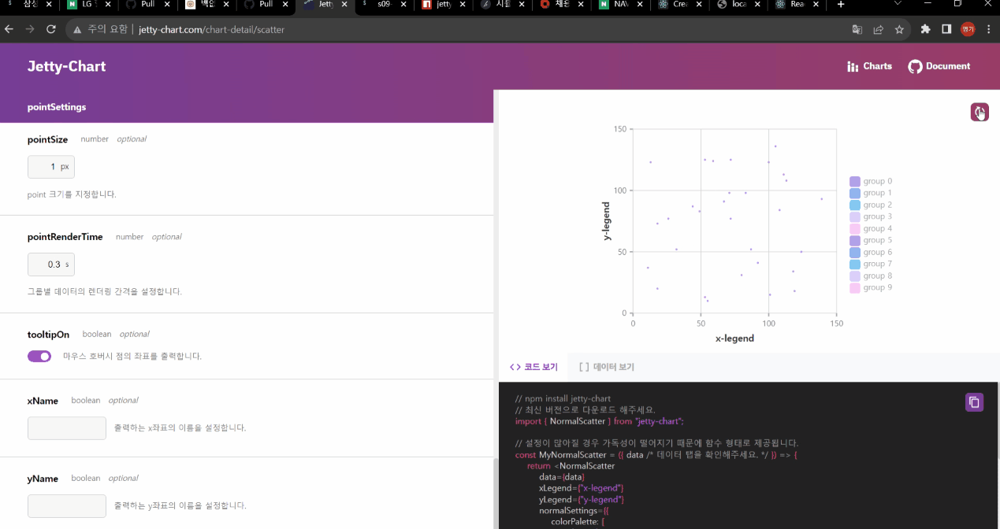

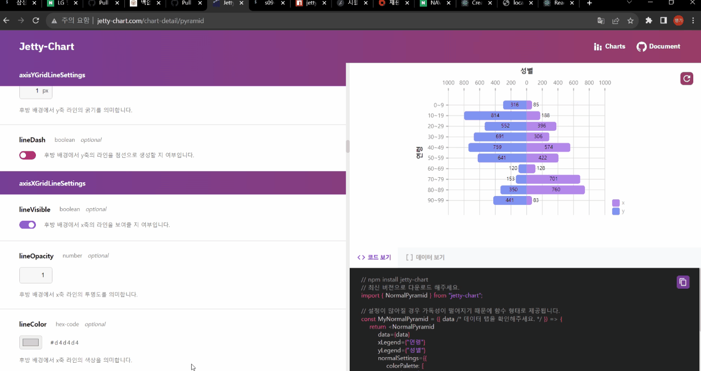

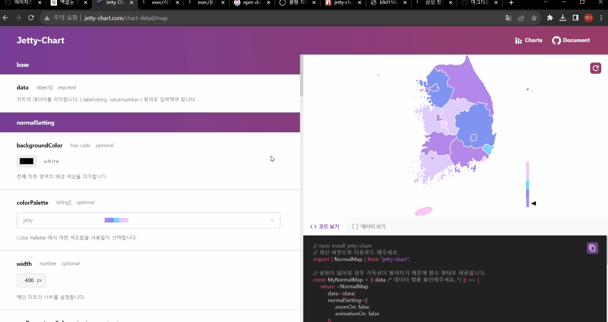

 

## 5. 원하는 차트의 코드를 복사하고 데이터를 형식에 맞춰 넣어, 만든 차트를 실행시킵니다.

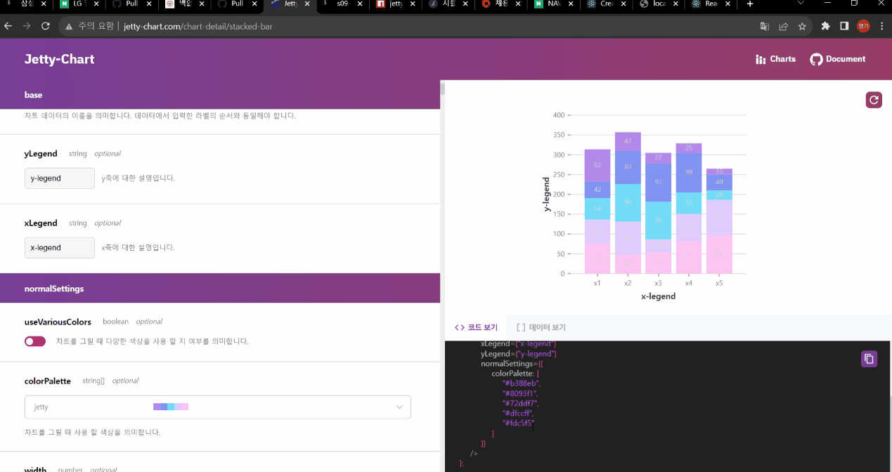

 

## 6. 더 많은 설정을 하고 싶으면 `jetty chart github`에 방문하여 볼 수 있습니다.

